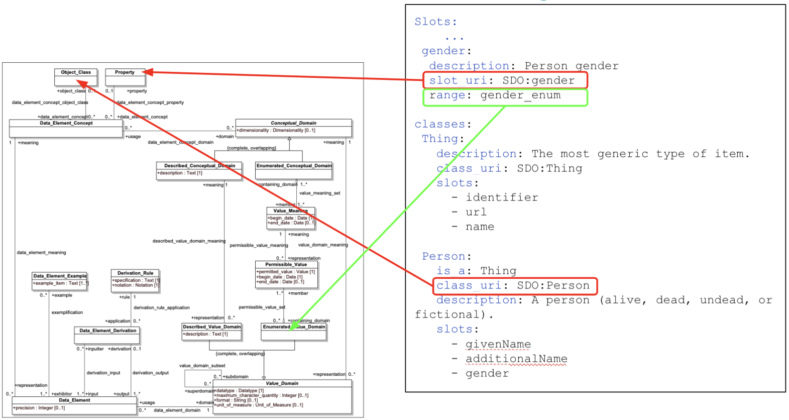
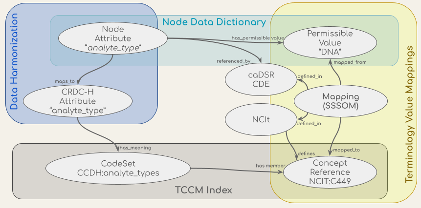
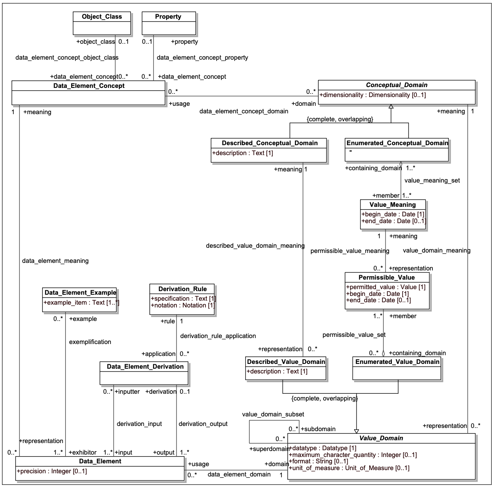
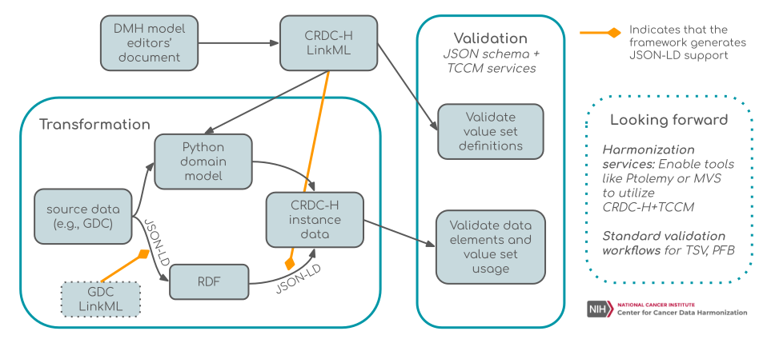

[Home](https://cancerdhc.github.io) | [CCDH Resources](https://cancerdhc.github.io/ccdh-resources) | [Terminology and Ontology Workstream](https://cancerdhc.github.io/terminology/) | [Project Task Dashboard](https://cancerdhc.github.io/dashboard/)

# CCDH Resources

Table of Contents

  * [Harmonized CRDC Data Model (CRDC-H)](#harmonized-crdc-data-model-crdc-h)
    * [The CCDH Harmonized Data Model (CRDC-H)](#the-ccdh-harmonized-data-model-crdc-h)
    * [LinkML](#linkml)
      * [Use of LinkML](#use-of-linkml)
      * [Why not UML?](#why-not-uml)
  * [CCDH Terminology Services](#ccdh-terminology-services)
    * [Terminology services API](#terminology-services-api)
    * [Terminology Common Core Model (TCCM)](#terminology-common-core-model-tccm)
    * [Harmonization of concepts](#harmonization-of-concepts)
    * [Creating NCI Thesaurus (NCIt) interoperability: NCIt-Plus](#creating-nci-thesaurus-ncit-interoperability-ncit-plus)
  * [Example Data Transformation Workflow](#example-data-transformation-workflow)

## Harmonized CRDC Data Model (CRDC-H)
Models are used to simplify complex ideas. A data model explicitly determines the structure of data, organizing data elements and standardizing how they relate to one another. An important distinction needs to be made between commonly used data dictionaries and a data model. A data dictionary usually consists of a list of fields and permissible values (for example, cancer stages), which are sometimes linked to terms from an ontology or controlled vocabulary. A data model, however, is a computable representation of all of the data elements and their relationships, and can contain components of the dictionary in the form of linked fields and tables (e.g., the SQL database). CCDH’s goal is to support the harmonization of equivalent data elements in disparate models across NCI’s Cancer Research Data Commons (CRDC) Repositories (nodes) to enable cross-node querying and multi-modal analytics. Individual nodes’ data models have been developed largely independently to fit specific data types and/or use cases. The CCDH is tasked with defining a shared data model for use across the CRDC, leveraging existing standards where possible to support interoperability with external data. 

### The CCDH Harmonized Data Model (CRDC-H)
The CRDC-H and its terminological infrastructure are being designed to meet the needs of systems like the Cancer Data Aggregator (CDA) that support integrated search and metadata-based analyses across datasets in the CRDC. We view the CRDC-H as a continuously-evolving artifact. To become and remain useful, the CRDC-H must be able to evolve and extend to meet new needs, while at the same time representing a constant semantic anchor for existing content. The version 1.0 release of the CRDC-H is a point in time along that model evolution, covering administrative, biospecimen, and clinical data entities from  multiple data commons; namely, PDC, GDC, ICDC, and HTAN. **The CRDC-H is natively expressed in the [LinkML modeling language](https://linkml.github.io/)**, allowing us to leverage the existing LinkML tool ecosystem, which includes tools for generating a number of useful artifacts, including [model documentation](https://cancerdhc.github.io/ccdhmodel), representations of the model in CSV and OWL, representations used for validating data such as JSON Schema and ShEx, and artifacts for interfacing with other technologies such as GraphQL and JSON-LD. The **[CRDC-H model repository](https://github.com/cancerDHC/ccdhmodel/)** contains tools for converting the spreadsheets where CRDC-H content is developed into formal LinkML, and holds the resulting LinkML model and its downstream artifacts for public use. By locating the CRDC-H LinkML model here, we can also leverage GitHub tools such as issue tracking and pull requests to provide versioning and maintain a history of changes to the model over time.

Looking ahead to Phase III, the CRDC-H will continue to evolve in the breadth and depth of coverage to include additional clinical entities (e.g., follow-up), additional subdomains (e.g. experimental metadata), and additional source models (e.g., ICDC). In the early stages of this phase, we anticipate making regular changes to the model as the community begins to evaluate version 1.0 against multiple use cases, but the pace of change should normalize over the next phase of work as feedback from implementers gets incorporated into our ongoing work.

### LinkML
The Linked data Model Language (LinkML; [linkml.github.io](http://linkml.github.io/)) is a pan-disciplinary, multi-purpose semantic data modeling framework designed for data dictionaries, data submission forms, data commons, and complex biomedical schemas. LinkML is designed to create “born-interoperable” data. This is achieved by enabling data to be prepared in an ontology-ready and semantic web-ready fashion across all disciplines. The goal is to be as simple as possible while retaining rigor. Currently, a LinkML schema, model, or data dictionary is authored as a file in YAML syntax (where the YAML conforms to the LinkML metamodel). The LinkML framework provides a number of features such as auto-generation of JSON-Schema as well as JSON-LD contexts for semantic web usage, as well as other modeling language IDLs or Schemas such as ShEx, protobuf, or GraphQL. Python data classes are also generated.

The LinkML framework is currently being used in a variety of projects in addition to the CCDH, such as the NCATS-funded Biomedical Data Translator, and DOE-funded National Microbiome Data Collaborative (NMDC). These and many other programs depend upon common modeling to support the massive data harmonization required for multi-modal and cross-disciplinary analytics. There is currently an undue dependence on ad hoc mappings and harmonizing of models, but this requires an enormous amount of manual labor and specialized expertise. The result is also not as rigorous in terms of provenance and computability as is needed for the ever increasing ecosystem of sources that need harmonizing that themselves continue to evolve. There are also exchange standards that lack a robust modeling framework, leading to a lack of interoperability, search and analytical capabilities. A shared semantic framework can enhance such standards by providing interoperability across deployments; a great example is the clinical exchange standard, FHIR.  

#### Use of LinkML
The decision to go with the LinkML modeling language for the development of our harmonized model provided us with an opportunity to leverage and incorporate the semantic elements that were previously “bolted on” to other models via the caDSR. LinkML directly incorporated the notions of Data Element Concept, via the *class_uri* and *slot_uri* components, as well as the *enumerated_value_domain* and *enumerated_value_meaning* pairs. LinkML allows modelers to simultaneously describe what an instance of a data record must look like and what the components in the model actually mean.

The [ISO/IEC 11179 standard](https://www.iso.org/standard/50340.html), a metadata registries metamodel of the International Organization for Standardization (ISO)’s technical committee on data management and interchange, evolved, in part, around the SQL standards developers’ need to add semantics to SQL data structures -- to be able to determine when columns from tables in different databases describe the same thing and to identify how one might go about transforming information from a source table/column to its analogous target -- i.e., *data model harmonization*.

The LinkML foundation of the CCDH model harmonization effort puts us into a position to leverage and *utilize* the background 11179 work. It enables:
* Incorporation of existing 11179 content in the NCI caDSR: we are leveraging the RDF representation of the caDSR content to incorporate the existing semantic annotation work in both the source (e.g., PDC, CDH) and target (CCD-H) models.
* Eventual export of new and enhanced semantic annotation back to the caDSR in the form of RDF or other target format.
* Documentation *and* validation of extant and proposed “value sets” (which we have chosen to call “code sets” for the sake of clarity) along with their associated permissible values.

In particular, the LinkML “Enumeration” model derives directly from the 11179 Enumerated Value Domain / Enumerated Value Meaning model, allowing one to list the possible values in a data field, document them and associate them with their intended meaning in an external ontology.

 

**Figure**: LinkML incorporates ISO/IEC 11179-3 meaning/data model.

The LinkML model *extends* the 11179 approach by allowing the algorithmic definition of permissible values, allowing modelers to state that the permissible value for a field is the *code* associated with the value meaning, the *URI*, *curie*, or (future) the HL7 FHIR *Coding* construct. The *class_uri* and *slot_uri* attributes allow modelers to check the list of intended meanings and to call out any meaning codes that may not be defined as being valid in the range of the associated *slot_uri*. LinkML relies on a customized set of terminology services that will interpret code set definitions (ala. FHIR or CTS2) to identify the complete set of possible value meanings that might appear in a given slot.

#### Why not UML?
In more traditional modeling languages, such as UML, model semantics are largely an afterthought -- intended meaning of classes, associations, attributes and values are defined as part of the textual documentation, if at all. Formal relationships between classes are implicit. Class hierarchy may reflect ontological hierarchy (all instances of class Y are also instances of class X) or may reflect shared behaviors and properties, even though they bear no ontological similarity. While UML *can* be used to describe “ontological models” (i.e. what a model instance describes), its primary purpose is to describe what a model instance can contain. Even when an ontological model is present, the links between the model of meaning and model of information is usually left as an exercise to the user.

When you add to this the high cost, inter-tool incompatibility and lack of MDA code generators for languages such as Python and Javascript, UML was not a viable choice for the CCDH project.

## CCDH Terminology Services
Terminology services are computational mechanisms to access and query over semantically encoded terminologies. A significant number of terminologies are used across the CRDC nodes and in cancer research in general. However, many of these terminologies are vast, making it challenging to find or validate content relevant to CRDC. The CCDH’s goal in developing terminology services is to make it easier for CRDC community members to find and request the content they need for data submission, validation, transformation, query, and analytics. CCDH also uses terminologies to define and validate the classes, properties, and, where appropriate, enumerated values in the CRDC-H and other source data models.

### Terminology services API
The CCDH terminology service is a RESTful API - an architectural style for an application program interface (API) that uses HTTP requests to access and use data - which supports the validation, lookup, binding, and mapping of the concepts in the CCDH data harmonization process and the transformation and validation workflow. The API uses a conceptual graph model based on the ISO/IEC 11179-3, a metadata registries metamodel of the International Organization for Standardization (ISO)’s technical committee on data management and interchange. The CCDH terminology service API integrates sources of model definitions, permissible values, concepts, and mappings, which are shown in the figure below. These sources include concept codes from the NCI Thesaurus (NCIt), the data dictionaries of metadata models such as the Genomics ([GDC](https://docs.gdc.cancer.gov/Data_Dictionary/viewer/)) and Proteomics ([PDC](https://pdc.cancer.gov/data-dictionary/dictionary.html#:~:text=The%20PDC%20data%20dictionary%20is,origin%2C%20usage%2C%20and%20format.)) Data Commons data dictionaries, the CCDH Harmonized model ([CRDC-H](https://github.com/cancerDHC/ccdhmodel)), the mappings of attributes from the CRDC Data Repositories’ (data nodes) models to the CRDC-H model, and the mappings of values in their data dictionaries to NCIt concept codes from [NCIt EVS](https://ncit.nci.nih.gov/ncitbrowser/pages/mapping_search.jsf?nav_type=mappings&b=0&m=0) and [caDSR](https://wiki.nci.nih.gov/pages/viewpage.action?pageId=309494141&sortBy=name&sortOrder=ascending). 

**Figure**: Conceptual models (ovals) of the data in the CCDH Terminology Service and their sources (the shaded boxes).

The endpoints in the RESTful service provide ways to navigate and retrieve this information. The API is built on top of the OpenAPI standard (OAS) and an OAS 3 spec (https://terminology.ccdh.io/openapi.json) is available for automated creation and exploration of the API capabilities with OAS-compatible toolings. The OAS API Documentation UI (https://terminology.ccdh.io/docs) could be used to explore and test the endpoints. All source code of the service and technical documentations are on GitHub (https://github.com/cancerDHC/ccdh-terminology-service). 

### Terminology Common Core Model (TCCM)
The Terminology Common Core Model (TCCM) is a code set catalog -- a minimal set of information of terminology concepts in a common format and a collection of links to get more information. TCCM will also serve as the base of a code set service, where performance is at a premium. The TCCM core is based on a Simple Knowledge Organization System (SKOS) model and semantics (as is the Common Terminology Services 2 (CTS2) specification, from which the TCCM is derived). The TCCM Maps are based on the  Simple Standard for Sharing Ontology Mappings (SSSOM) model. TCCM provides a set of standard metadata elements to describe mappings and is capable of providing additional provenance of the mappings. The TCCM model is written in LinkML and a code repository for this model can be found at https://github.com/HOT-Ecosystem/tccm-model. 

The TCCM API ([GitHub repository](https://github.com/HOT-Ecosystem/tccm-api)) provides implementations of RESTful service endpoints to query and validate concepts and terms, to and retrieve and resolve definitions of code sets. The TCCM API is integrated into the CCDH terminology service API. 

### Harmonization of concepts
Data harmonization entails the standardization of terms, data models, and codesets/common data elements (CDEs). In order to perform a full harmonization, it is necessary to map concepts from controlled vocabularies, ontologies, and standardized elements. It is critically important to encode which concepts are equivalent or “related,” such as in a broader or narrower fashion, as well as to include provenance information about how the mappings are created. Fundamental to harmonization is how mappings are robustly created according to well defined and documented rules.

The CRDC nodes created mappings of terms used by their resources to [National Cancer Institute Thesaurus (NCIt)](https://ncithesaurus.nci.nih.gov/ncitbrowser/pages/home.jsf?version=20.11e) and [NIH Common Data Elements (CDEs)](https://cde.nlm.nih.gov/home), and these were obtained by the CCDH team and reviewed and iterated upon. Initial work involved a manual review of the mappings provided by the nodes. Where appropriate, we added new NCIt mapping via lookup in the [CDE Browser](https://cde.nlm.nih.gov/cde/search), if a term was not already mapped. We reviewed the existing mappings and updated the mapping if we determined a more suitable mapping was available. These revised mappings were shared with the nodes for their review and approval, and we iterated on the mappings to produce the final harmonized data sets. This process also identified gaps in NCIt, for which new term requests will be made.

### Creating NCI Thesaurus (NCIt) interoperability: NCIt-Plus
The National Cancer Institute Thesaurus (NCIt) serves as a combination of a “thesaurus” (i.e., a collection of synonymous and similar terms across different terminologies) and a lexicon (a set of codes that represent “concepts” in a given language). As Hartel, et. al. have emphasized ([PMID:15797001](https://pubmed.ncbi.nlm.nih.gov/15797001/)) NCIt is *not* a formal ontology. An ontology is the classification of knowledge for a specific domain of study, where the relationships between concepts are formally defined and logically related, which allows for computational reasoning ([Haendel et al., 2018. PMID:30304648](https://pubmed.ncbi.nlm.nih.gov/30304648/)). The NCIt community uses the Web Ontology Language (OWL) and description logic to help organize the NCIt, but when one looks for formal definitions of classes such as *Specimen*, *Biospecimen*, *Fixed Formalin Paraffin Embedded RNA*, etc., one only finds a bare minimum of necessary definitions. We can learn that every instance of a *Biospecimen* is also an instance of a *Specimen*, but no differentia is available. For instance, what makes a *Biospecimen* different from other subclasses of specimen, such as *Agglutinated Specimen*, *Analyte*, *B-Ion*, *Homogenate*, etc. This means that, while the NCIt is an excellent starting point, we still have to augment the NCIt to support integration, inference, and querying, as well as adding additional content. 

The NCIt-Plus is an OBO Foundry Library-friendly version of NCIt. The [Open Biological and Biomedical Ontology (OBO) Foundry](http://obofoundry.org/) is a community of ontology developers who are committed to developing ontologies under a shared set of principles, including reusing each other’s existing ontologies and ensuring interoperability between ontologies. OBO ontologies are developed as community resources, leveraging expertise from both domain experts and semantic technology experts. The processes for adding and modifying ontology terms are carefully vetted by each respective community, resulting in resources that are scientifically and logically sound. Reusing existing ontologies, ensures the precise and accurate representation of specific branches of knowledge, and prevents duplication of efforts. In addition, it allows increased interoperability between ontologies, which is the ability to exchange and make use of information to aid in data integration and harmonization. The NCIt-Plus is an extension of the NCIt providing a deeper integration with ontologies from the OBO library, such as the Mondo Disease Ontology, Gene Ontology (GO), Uber Anatomy Ontology (Uberon) and Cell Ontology (CL). 

While NCIt-Plus contains the same labels and terminology as the original NCIt, it replaces the classes and corresponding identifiers of specific concept hierarchies in NCIt with those provided by domain-specific ontologies from the OBO Library, for use in the logical axioms of the disease terminology. This allows for increased interoperability of the NCIt with other OBO ontologies. For example, NCIt anatomical terms and logical relationships are replaced by corresponding concepts from [Uberon](http://uberon.github.io/), which is also used in other OBO Foundry ontologies like the [Mondo Disease Ontology](http://mondo.monarchinitiative.org/) and the [Human Phenotype Ontology](https://hpo.jax.org/). Currently, both Uberon and the [Cell Ontology](https://github.com/obophenotype/cell-ontology) are included in NCIt-Plus; current efforts are underway to extend this integration to terminologies including [Gene Ontology](http://geneontology.org/) (for biological processes, molecular function and cellular components) and  the [NCBI taxonomy](https://www.ncbi.nlm.nih.gov/taxonomy) (for organisms). The build pipeline also makes available some smaller subsets of NCIt, such as a subset of NCIt-Plus focused on the [Neoplasm Core](https://evs.nci.nih.gov/ftp1/NCI_Thesaurus/Neoplasm/About_Core.html), as well as a slim based on terms used in [OncoTree](http://oncotree.mskcc.org/oncotree/#/home). More information about available downloads can be found on the [wiki](https://github.com/NCI-Thesaurus/thesaurus-obo-edition/wiki/Downloads). Our ultimate goal is to adopt OBO conventions for term identifiers and ontology dereferencing to improve semantic integration with existing OBO ontologies. 

NCIt-Plus is critically important to realize the interoperability goals of CRDC, as multiple data models have been coupled to the NCIt via the caDSR *data_element_concept_object_class*, *data_element_concept_property*,  and *permissible_value_meaning* links (see figure below) 

The model in the above figure presents a high-level view of the ISO 11179-3 data element description model (from https://www.iso.org/standard/50340.html). In the upper left hand corner, *Data_Element_Concept* identifies a specific property or characteristic or a specific type of object.  Data element concepts might include “Person.age”, “Physical object.weight” or “Human Subject.blood pressure”, with “Person”, “Physical object” and “Human subject” being object classes and “age”, “weight” and “blood pressure” being properties.

*Data_Element* (DE) represents the way that a given *Data_Element_Concept* (DEC) is represented in a given data model. The *Value_Domain* element in the lower right hand side describes the set of possible values that could be associated with a given DEC in the context of a model. As an example, “Person.age” might be represented as an integer, whose units of measure were “years.” “Physical object.weight” might be represented as a positive decimal number whose units are “kilograms” in one database, as a positive integer whose units were “ounces” in a second and, even, perhaps an enumerated value domain in a third database, where the permissible values consist of the values “-”, “0” and “+”.

The first two examples are instances of *Described_Value_Domains*, where the associated numbers or text are directly interpreted according to the rules laid out in the *Described_Textual_Domain* space. The “Person.age” representation might be described as the age of an individual at the point that associated data in the record was recorded, rounded off to the nearest whole number. The *Enumerated_Value_Domain* example, however, requires additional information, as each possible (permissible) value needs to be coupled with an associated meaning. In our example, we might define “-” as “significantly below the expected weight for the object being measured, “0” as at the expected weight within a certain margin or error and, “+” as significantly above.

Read more about previous work on the NCIt-Plus effort [here](https://monarchinit.medium.com/tailoring-the-nci-thesaurus-for-semantic-interoperability-21305ccfe3a6).

## Example Data Transformation Workflow
To provide an overview of the data model and data transformation steps and tools that can be used to ultimately generate CRDC-H harmonized data, are in the process of instantiating an example data transformation workflow. This will ensure that the products of CCDH work well together, demonstrating the use of transformation and validation tools on both the CRDC-H model as well as data that conforms to that model. This will include (1) the conversion of the CRDC-H from a series of source data model spreadsheets into a LinkML model, (2) validating that the generated LinkML model is correctly specified, (3) downloading example data from several CRDC nodes and eventually from the CDA, (4) transforming these example data into instance data in the CRDC-H data model, and (5) testing that the transformed example data can be validated against the CRDC-H data model in LinkML. This example transformation workflow is ready for user testing and we welcome feedback using GitHub (https://github.com/cancerDHC/example-data) or the Slack [Helpdesk channel](https://cancerdhc.slack.com/archives/CPGG83HCG) in the CCDH Workspace.

**Figure**: Transformation and Validation Tools
