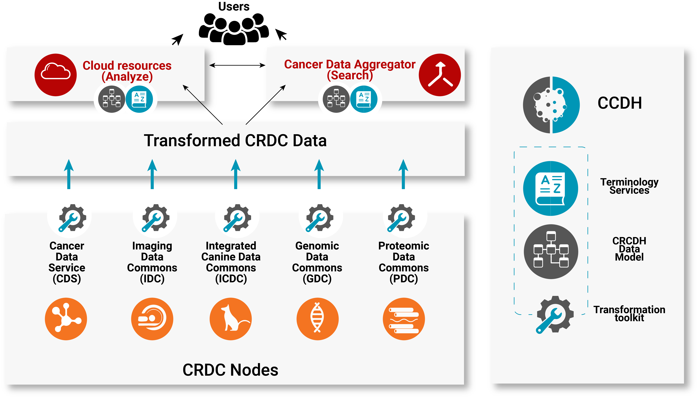

# Center for Cancer Data Harmonization

The CCDH serves three main roles within the Cancer Research Data Commons (CRDC) ecosystem:
* Facilitate retrospective and prospective semantic harmonization of data across nodes of the CRDC.
* Coordinate the community to ensure quality “fit for purpose” design and implementation of standards that will facilitate interoperability of heterogeneous data types and CRDC resources
* Find agreement across the CRDC community, determining annotation and harmonization needs, and helping to build quality assurance resources that function across the CRDC.

**The role of CCDH in the wider CRDC environment.**
