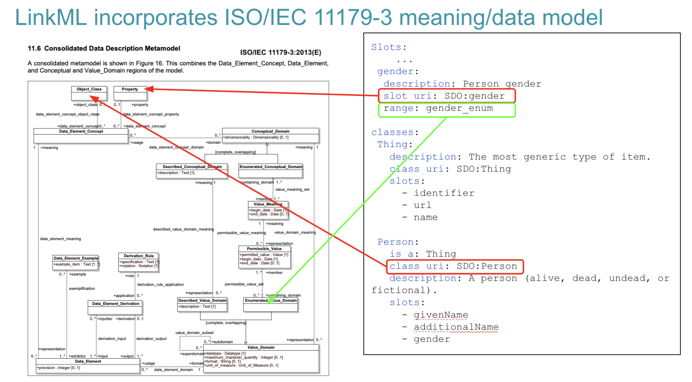

# Terminology and Ontology Workstream

Table of Contents

  * [Decision to use LinkML](#decision-to-use-linkml)
    + [UML](#uml)
    + [HL7 FHIR](#hl7-fhir)
    + [Use of LinkML](#use-of-linkml)
  * [CCDH Terminology Services](#ccdh-terminology-services)
    + [Terminology services API](#terminology-services-api)
    + [Terminology Common Core Model (TCCM)](#terminology-common-core-model--tccm-)
  * [Harmonization of concepts](#harmonization-of-concepts)
  * [NCIt, NCIt+ and Ontology](#ncit--ncit--and-ontology)
    + [GCD, PDC and other models in caDSR](#gcd--pdc-and-other-models-in-cadsr)
      - [Question 1: What is a “Molecular Specimen” and what does or does not fit into that bucket?](#question-1--what-is-a--molecular-specimen--and-what-does-or-does-not-fit-into-that-bucket-)
      - [Question 2:  I have separated the preservation method from the actual specimen content itself.  I have DNA, RNA and mitochondrial RNA specimens, all of which are in Paraffin-embedded blocks.  Some of these specimens have been preserved using formaldehyde, some with propylene glycol and we also have some where the method has not been recorded.  In addition, I have specimens that include a mixture of DNA and RNA.  How do I record this information?](#question-2---i-have-separated-the-preservation-method-from-the-actual-specimen-content-itself--i-have-dna--rna-and-mitochondrial-rna-specimens--all-of-which-are-in-paraffin-embedded-blocks--some-of-these-specimens-have-been-preserved-using-formaldehyde--some-with-propylene-glycol-and-we-also-have-some-where-the-method-has-not-been-recorded--in-addition--i-have-specimens-that-include-a-mixture-of-dna-and-rna--how-do-i-record-this-information-)
      - [Question 3: I also have samples of amniotic fluid.  Do these count as “Molecular Specimens”?  Can these be recorded in this data record as well?](#question-3--i-also-have-samples-of-amniotic-fluid--do-these-count-as--molecular-specimens----can-these-be-recorded-in-this-data-record-as-well-)
      - [Question 4: If I record a sample as “DNA” am I asserting that it is not FFPE DNA?  That I don’t know?  Should FFPE DNA be recorded with two  types - DNA and FFPE DNA?](#question-4--if-i-record-a-sample-as--dna--am-i-asserting-that-it-is-not-ffpe-dna---that-i-don-t-know---should-ffpe-dna-be-recorded-with-two--types---dna-and-ffpe-dna-)
    + [Using the NCIt Plus with real data](#using-the-ncit-plus-with-real-data)

## Decision to use LinkML

### UML 

In more traditional modeling languages, such as UML, model semantics are largely an afterthought -- intended meaning of classes, associations, attributes and values are defined as part of the textual documentation, if at all.  Formal relationships between classes are implicit.  Class hierarchy may reflect ontological hierarchy (all instances of class Y are also instances of class X) or may reflect shared behaviors and properties, even though they bear no ontological similarity.  While UML *can* be used to describe “ontological models” (i.e. what a model instance describes), its primary purpose is to describe what a model instance can contain.  Even when an ontological model is present, the links between the model of meaning and model of information is usually left as an exercise to the user.

When you add to this the high cost, inter-tool incompatibility and lack of MDA code generators for languages such as Python and Javascript, UML was not a viable choice for the CCDH project.

### HL7 FHIR

In the HL7 V3 mode, the model semantics  were formally defined in the Reference Information Model (RIM).  The USAM and other components of the model provided a solid ontological foundation, this foundation was also very abstract.  The semantics of individual model elements were (theoretically) covered by the HL7 terminology section.  Unfortunately, with minor exceptions, the HL7 terminology section was little more than a hierarchical lexicon, and the intended meaning of model elements remained strictly textual and not widely used and shared.  In any case, HL7 V3 is no longer actively being developed and used, so it was not considered as tooling for the CCDH effort.

While the HL7 FHIR standard incorporated components designed to carry model semantics, these components have yet to be put to much serious use. (Reference Graham’s blog post on Semantics, the W5 ontology, and the HL7 / SNOMED Template transformation tools.

Both HL7 V3 and FHIR did include the ability to provide semantics for enumerated value domains (aka. “value sets”).  While the meanings of the containing class (e.g. Observation) and attribute (e.g. urine color) are still largely informal, HL7 has gone to some effort to specify a (typically very broad) set of permissible values for the actual attribute.  Because HL7 is an official standards body, however, they control both the permissible value meanings (ala. ISO 11179) and the values themselves, as exemplified by the HL7 V3 CD and HL7 FHIR CodedEntry data types.  Our harmonization effort requires that we be able to associate a set of values in an *existing* model (e.g. “1”, “2, “9” or “H”, “R”, “D”, etc) with their formal meaning.  As the models already existed, we could not mandate that the “concept code” be used as the actual data value.

> Data harmonization entails an additional step that is not currently included as a part of the HL7 standards -- a declarative description of how an external data source such as that contained in the Epic system is mapped to the HL7 FHIR equivalent.  The documentation, validation and transformation processes are all left to Epic and its customers and, to the best of our knowledge, are not publicly documented or validated.

The ISO/IEC 11179 model, as exemplified by the caDSR, provides a mechanism that allows communities of users to take existing models and add class, attribute and value semantics.  One of the goals of the CCDH data harmonization process is to assemble these disparate components -- the models and the model semantics -- into an integrated whole.   We (the CCDH modeling group) were faced with a difficult choice.  Should we:

* Leverage the HL7 FHIR modeling language and its (unused) semantic components to represent the various CCDH input and target models or…
* … use a semantic modeling tool (LinkML) that was being actively developed for supporting data harmonization in an entirely different domain.

While, in the beginning, we had some weak leanings toward option (a) (FHIR modeling language), we encountered a number of issues that would need to be resolved, including:

* The FHIR community had put the majority of its effort into tools and processes to support FHIR “profiles” -- extensions and constraints to existing FHIR Resource models.  While the notion of a “logical” FHIR model (i.e. a model built from scratch vs. one based on the FHIR resource infrastructure) existed and had been used demonstrations of the FHIR mapping language amongst other things, the actually creation of one of these models required a good deal of intimate knowledge of the domain and the intricacies and foibles of the associated tools.
* The FHIR modeling language and its artifacts were well accepted in the clinical domain, there was a fair amount of pushback on its applicability in other domains such as genomics, phenomics and secondary data use.

Neither of these problems was insurmountable unto themselves -- tools could be built for FHIR just as readily as they could for the LinkML work, although we faced a bit of a language barrier, as the majority of the CCDH community worked with the Python language and FHIR was very committed to Java at the core.   FHIR training could be supplied for existing publication artifacts and they could be extended into idioms that were more readily recognized by our user community.

The other issue with FHIR,  however, was more problematic.  The FHIR community did not want models to be developed outside of the existing resource base and it became apparent that, not only would our efforts not be supported by the existing FHIR community, but we could potentially face opposition to our efforts.   

The final element in the decision to move to LinkML involved FHIR and RDF.  Our community was leveraging RDF and Ontologies for data transformation and the FHIR community had little or no interest in moving into that space.

### Use of LinkML

The decision to go with the LinkML modeling language for the data harmonization provided us with an opportunity to leverage and incorporate the semantic elements that were previously “bolted on” to other models via the caDSR.   LinkML directly incorporated the notions of Data Element Concept, via the class_uri and slot_uri components as well as the enumerated_value_domain and enumerated_value_meaning pairs.  LinkML allows modelers to simultaneously describe what an instance of a data record must look like and what the components in the model actually mean.

The ISO/IEC 11179 standard evolved, in part, around the SQL standards developers’ need to add semantics to SQL data structures -- to be able to determine when columns from tables in different databases describe the same thing and to identify how one might go about transforming information from a source table/column to its analogous target -- i.e. *data model harmonization*.

The LinkML foundation of the CCDH model harmonization project puts us into a position to leverage and *utilize* the background 11179 work.  It enables:

* Incorporation of existing 11179 content in the NCI caDSR: we are leveraging the RDF representation of the caDSR content to incorporate the existing semantic annotation work in both the source (e.g. PDC, CDH) and target (CCD-H) models.
* Eventual export of new and enhanced semantic annotation back to the caDSR in the form of RDF or other target format.
* Documentation *and* validation of extant and proposed “value sets” (which we have chosen to call “code sets” for the sake of clarity) along with their associated permissible values.

In particular, the LinkML “Enumeration” model derives directly from the 11179 Enumerated Value Domain / Enumerated Value Meaning model, allowing one to list the possible values in a data field, document them and associate them with their intended meaning in an external ontology. See [LinkML Yosemite Presentation (Slides 38-43)](https://docs.google.com/presentation/d/1jtV2vQhCwsGv_9fPplkG8ww1ru4V_JYyRGLAm2dxvdE/edit#slide=id.gcf33f470c2_1_311)

 

The LinkML model extends the 11179 approach by allowing the algorithmic definition of permissible values, allowing modelers to state that the permissible value for a field is the code associated with the value meaning, the URI, curie, or (future) the HL7 FHIR Coding construct.  The class_uri and slot_uri attributes allow modelers to check the list of intended meanings and to call out any meaning codes that may not be defined as being valid in the range of the associated slot_uri.  LinkML relies on a customized set of terminology services that will interpret code set definitions (ala. FHIR or CTS2) to identify the complete set of possible value meanings that might appear in a given slot.

## CCDH Terminology Services

Terminology services are computational mechanisms to access and query over semantically encoded terminologies. A significant number of terminologies are used across the CRDC nodes and in cancer research in general. However, many of these terminologies are vast, making it challenging to find or validate content relevant to CRDC. The CCDH’s goal in developing terminology services is to make it easier for CRDC community members to find and request the content they need for data submission, validation, transformation, query, and analytics. CCDH also uses terminologies to define and validate the classes, properties, and, where appropriate, enumerated values in the CRDC-H and other source data models.

### Terminology services API

The CCDH terminology service is a RESTful API - an architectural style for an application program interface (API) that uses HTTP requests to access and use data - which supports the validation, lookup, binding, and mapping of the concepts in the CCDH data harmonization process and the transformation and validation workflow. The API uses a conceptual graph model based on the ISO/IEC 11179-3, a metadata registries metamodel of the International Organization for Standardization (ISO)’s technical committee on data management and interchange. The CCDH terminology service API integrates sources of model definitions, permissible values, concepts, and mappings, which are shown in the figure below. These sources include concept codes from the NCI Thesaurus (NCIt), the data dictionaries of metadata models such as the Genomics (GDC) and Proteomics (PDC) Data Commons data dictionaries, the CCDH Harmonized model (CRDC-H), the mappings of attributes from the CRDC Data Repositories’ (data nodes) models to the CRDC-H model, and the mappings of values in their data dictionaries to NCIt concept codes from NCIt EVS and caDSR. 

Figure: Conceptual models (ovals) of the data in the CCDH Terminology Service and their sources (the shaded boxes). 

The endpoints in the RESTful service provide ways to navigate and retrieve this information. The API is built on top of the OpenAPI standard (OAS) and an OAS 3 spec (https://terminology.ccdh.io/openapi.json) is available for automated creation and exploration of the API capabilities with OAS-compatible toolings. The OAS API Documentation UI (https://terminology.ccdh.io/docs) could be used to explore and test the endpoints. All source code of the service and technical documentations are on GitHub (https://github.com/cancerDHC/ccdh-terminology-service). 

### Terminology Common Core Model (TCCM)

The Terminology Common Core Model (TCCM) is a code set catalog -- a minimal set of information of terminology concepts in a common format and a collection of links to get more information. TCCM will also serve as the base of a code set service, where performance is at a premium. The TCCM core is based on a Simple Knowledge Organization System (SKOS) model and semantics (as is the Common Terminology Services 2 (CTS2) specification, from which the TCCM is derived). The TCCM Maps are based on the  Simple Standard for Sharing Ontology Mappings (SSSOM) model. TCCM provides a set of standard metadata elements to describe mappings and is capable of providing additional provenance of the mappings. The TCCM model is written in LinkML and a code repository for this model can be found at https://github.com/HOT-Ecosystem/tccm-model. 

The TCCM API (GitHub repository) provides implementations of RESTful service endpoints to query and validate concepts and terms, to and retrieve and resolve definitions of code sets. The TCCM API is integrated into the CCDH terminology service API. 

## Harmonization of concepts

Data harmonization entails the standardization of terms, data models, and codesets/common data elements (CDEs). In order to perform a full harmonization, it is necessary to map concepts from controlled vocabularies, ontologies, and standardized elements. It is critically important to encode which concepts are equivalent or “related,” such as in a broader or narrower fashion, as well as to include provenance information about how the mappings are created. Fundamental to harmonization is how mappings are robustly created according to well defined and documented rules.

The CRDC nodes created mappings of terms used by their resources to National Cancer Institute Thesaurus (NCIt) and NIH Common Data Elements (CDEs), and these were obtained by the CCDH team and reviewed and iterated upon. Initial work involved a manual review of the mappings provided by the nodes. Where appropriate, we added new NCIt mapping via lookup in the CDE Browser, if a term was not already mapped. We reviewed the existing mappings and updated the mapping if we determined a more suitable mapping was available. These revised mappings were shared with the nodes for their review and approval, and we iterated on the mappings to produce the final harmonized data sets. This process also identified gaps in NCIt, for which new term requests will be made.

## NCIt, NCIt+ and Ontology

The National Cancer Institute Thesaurus is as it is advertised.  It’s role in the situation is to serve as a combination of a “thesaurus” (i.e. a collection of synonymous and similar terms across different terminologies) and a lexicon -- a set of codes that represent “concepts” in a given language.

As [Hartel, et. al. have emphasized](https://www.sciencedirect.com/science/article/pii/S1532046404000917?via%3Dihub) NCIt is *not* a formal ontology.  The NCIt community uses OWL and description logic to help organize the NCIt, but when one looks for formal definitions of classes such as Specimen, Biospecimen, Fixed Formalin Paraffin Embedded RNA, etc., one only finds a bare minimum of necessary definitions. We can learn that every instance of a Biospecimen is also an instance of a Specimen, but no differentia is available -- what makes a Biospecimen different from other subclasses of specimen, such as Agglutinated Specimen, Analyte, B-Ion, Homogenate, etc.  

This means that, while the NCIt is an excellent starting point, as multiple data models have been coupled to the NCIt via the caDSR data_element_concept_object_class, data_element_concept_property,  and permissible_value_meaning links (see figure below), we still have to augment the NCIt with an actual ontology -- extant when possible, but we may also have to add our own items.  The remainder of this discussion is about this process and what needs to happen.

The above model presents a high-level view of the ISO 11179-3 data element description model.  In the upper left hand corner, Data_Element_Concept identifies a specific property or characteristic or a specific type of object.   Data element concepts might include “Person.age”, “Physical object.weight” or “Human Subject.blood pressure”, with “Person”, “Physical object” and “Human subject” being object classes and “age”, “weight” and “blood pressure” being properties.

Data_Element (DE) represents the way that a given Data_Element_Concept (DEC) is represented in a given data model.  The Value_Domain element in the lower right hand side describes the set of possible values that could be associated with a given DEC in the context of a model.  As an example, “Person.age” might be represented as an integer, whose units of measure was years.  “Physical object.weight” might be represented as a positive decimal number whose units are Kg in one database, as a positive integer whose units were ounces in a second and, even, perhaps an enumerated value domain in a third database, where the permissible values consist of the values “-”, “0” and “+”.

The first two examples are instances of Described_Value_Domains, where the associated numbers or text are directly interpreted according to the rules laid out in the Described_Textual_Domain space.  The “Person.age” representation might be described as the age of an individual at the point that associated data in the record was recorded, rounded off to the nearest whole number.  The Enumerated_Value_Domain example, however, requires additional information, as each possible (permissible) value needs to be coupled with an associated meaning.  In our example, we might define “-” as “significantly below the expected weight for the object being measured, “0” as at the expected weight within a certain margin or error and, “+” as significantly above.

### GCD, PDC and other models in caDSR

Using the above diagram as a reference point, we can now take a peek at a data element defined in the Genomic Data Commons (GDC) -- the object “Analyte” and the property “analyte_type”.  (https://docs.gdc.cancer.gov/Data_Dictionary/viewer/#?view=table-definition-view&id=analyte)
By following the link from analyte_type to the caDSR, we find the following information:

We quickly discover, however, that we are using the NCIt strictly as a lexicon.  While the Object Class C19157 (Specimen) generally situates us in the NCIt, the second concept, C25574 (Molecular) turns out to have no formal relationship whatsoever with Specimen.  There is nothing in the ontology that states that certain kinds of specimens are “molecular”, let alone identify what characteristics differentiate “molecular specimens” from the “non-molecular” alternatives. 

The second thing that we note is that the property itself, “Type”, is quite generic and, while it makes sense in common english usage, there is little formal value within the NCIt itself. 
 
OWL representation of the NCIt “Type” Class

The set of permissible values for the Analyte.analyte_type data includes the following:

…
Assume, now, that you are approaching this model with a set of specimens and the data associated with them.  The questions that may need addressing include:
Analyte is defined as a “Molecular Specimen”.  What does this mean and do my specimens fit this definition?
I have separated the preservation method from the actual specimen content itself.  I have DNA, RNA and mitochondrial RNA specimens, all of which are in paraffin-embedded blocks.  Some of these specimens have been preserved using formaldehyde, some with propylene glycol and we also have some where the method has not been recorded.  In addition, I have specimens that include a mixture of DNA and RNA.  How do I record this information?
I also have samples of amniotic fluid.  Do these count as “Molecular Specimens”?  Can these be recorded in this data record as well?
If I record a sample as “DNA” am I asserting that it is not FFPE DNA?  That I don’t know?  Should FFPE DNA be recorded with two  types - DNA and FFPE DNA?
These sorts of questions arise when we attempt to connect the values above to an actual ontology.  In addition, ontology is an ideal way to provide human and algorithmic answers to this sort of question.

We will start with some components of the NCI Thesaurus as it exists today and posit one way one might augment it with ontological statements to address some of the above issues.

#### Question 1: What is a “Molecular Specimen” and what does or does not fit into that bucket?

At first blush, the answer is less than obvious -- we aren’t really sure why the term “Molecular” was coupled with specimen and which of the subclasses (Agglutinated Specimen, Analyte, Biospecimen, homogenate, etc) might fit that definition.   Referring back to the source data dictionary, however:

We note that the category of an analyte is “biospecimen”, so we propose the following changes:
Change the associated Object_Class from “Specimen”/”Molecular” to “Biospecimen” 
Extend the definition of “Biospecimen” to include its specific differentia
State what of the remaining specimen types don’t  count as “biospecimens”

(Note: This is clearly not a complete or even correct definition, but its intent is to show how ontology in the form of NCIt+ can be used to improve the documentation and eventual computability of a model.)

#### Question 2:  I have separated the preservation method from the actual specimen content itself.  I have DNA, RNA and mitochondrial RNA specimens, all of which are in Paraffin-embedded blocks.  Some of these specimens have been preserved using formaldehyde, some with propylene glycol and we also have some where the method has not been recorded.  In addition, I have specimens that include a mixture of DNA and RNA.  How do I record this information?

The first thing we note is that the permissible values FFPE DNA and FFPE RNA are both subclasses (types of) Biospecimen.  Note, however, that DNA is not (and should not be) a subclass of Biospecimen -- we do not want to assert that every instance of DNA is also an instance of a Biospecimen -- what we want to say, instead, is that every Biospecimen whose primary component is DNA is an instance of a DNA Biospecimen.   We will also note two pre-coordinated terms “Imortalization EBV” and “Normal EBV Immortalization” -- specimens whose primary component is EBV (??? - I’m not a pathologist so I can only guess at the intent) that have additional characteristics.

We end up teasing two separate aspects out of the above entries - one being a list of possible preservation methods (formaldehyde, propylene glycol, paraffin embedding) and a second being the description of the primary component(s) that have been preserved.

We extend the existing Biological Sample Preservation Procedure branch to include Paraffin Embedding, Fixed Formalin and Propylene Glycol methods, as well as an entry for FFPE which is a procedure that consists of both aspects:

We then proceed to add two new object properties -- analysis_target, with the domain of Specimen and range of Substance and uses_preservation_method with a Specimen domain and Preservation Procedure range

We can then use above properties to flesh out our definition of Biospecimen

Adding the fact that biospecimens have at least one analysis target and at least one preservation method (Obviously not 100% correct, but this is an issue that we need to address in the ontology space.)

We can then step down to specific Biospecimens:

Above, we’ve defined Fixed Specimen as any specimen that uses Paraffin Embedding as a preservation method, and FFPE DNA as Formalin Fixation with a target of DNA.

(The EBV, Immortalization and Normal Immortalization issues need to be addressed in a similar fashion…)

#### Question 3: I also have samples of amniotic fluid.  Do these count as “Molecular Specimens”?  Can these be recorded in this data record as well?

We will begin by noting that there is probably not an objective answer to this question.  The decision of what does and doesn’t count as a “Biospecimen” is more one of fiat than of reality.  We need to strengthen our definition of Biospecimen slightly -- at the moment, we’ve said that every Biospecimen has at least one analysis_target that is an instance of a Protein/Peptide Substance. We haven’t stated, however, that this is the only sort of target.  If say that all analysis targets must be this:

Then the question becomes, have we classified Amniotic Fluid as a Protein/Peptide Substance or not?

#### Question 4: If I record a sample as “DNA” am I asserting that it is not FFPE DNA?  That I don’t know?  Should FFPE DNA be recorded with two  types - DNA and FFPE DNA?

As with the Amniotic Fluid example above, this decision must be made by the community.  Once decided, however, the result can be recorded in the ontology.  For our purposes, we choose to state “DNA” in this context means any sample that includes an analysis_target of DNA, whether it is preserved or not.  We will add a new class (note: we aren’t paying attention to computational complexity at the moment…), “Non_FFPE_preservation” which we can use to model DNA that doesn’t use FFPE as a preservation method:

We can then add these entries to the possible biospecimens:

### Using the NCIt Plus with real data

Permissible Values, Value Meanings and Conceptual Domains

If we now zero in on the upper right hand quadrant of the ISO 11179 model:

We note that we have three separate components:
Permissible_Value: the text that actually appears in a particular column of a SQL table or field in a data record
Value_Meaning: a subclass of an Enumerated_Conceptual_Domain (EC) that represents a subset of the possible members of the ECD itself.
Enumerated_Conceptual_Domain: a definition of the set of all possible instances referenced by the data element concept.

Not all value_meanings have matching permissible_values for a given data element.  As an example, we might define a DEC of Light.color, whose conceptual domain is “color”.  A stoplight supply company might define a database that includes a DE for stoplight colors, with the permissible values of “R”, “Y”, “G”, and “O”, which map to the value meanings corresponding to (stoplight) Red, Yellow, Green and NOT(Red, Yellow, Green) respectively.  A second company may sell Christmas tree lights, where the permissible values range across a broad spectrum of colors, while a third, which sells custom colors, may want to allow any color that appears in this conceptual domain.

The second example above could potentially be addressed by assigning permissible values from, say, the set of positive integers, but as soon as the number of possibilities go beyond single digits, this approach quickly becomes unmanageable.  The third example above is dependent on the definition of the domain itself, rendering independent permissible values not even possible.

A possible interpretation of the above model (the one that we are using) is that the Enumerated_Conceptual_Domain consists of any referenced instance that would classify as a member of that domain, whether a defined (“coordinated”) concept definition or not.  The set of Value_Meanings would represent all existing concept definitions that classify as a member of the corresponding domain.  The set of Permissible_Values can be defined as above (enumerated) or defined as being all of the codes or URI’s or Curies or any other unique identifier associated with the corresponding meanings.

